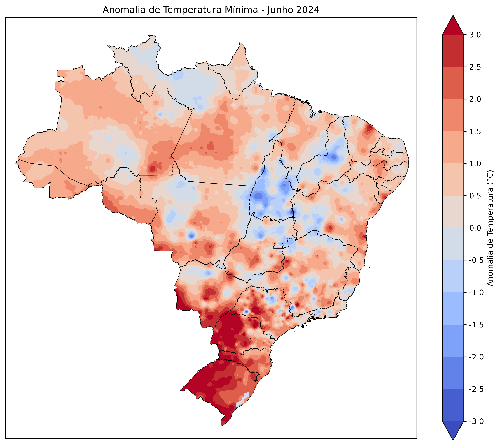
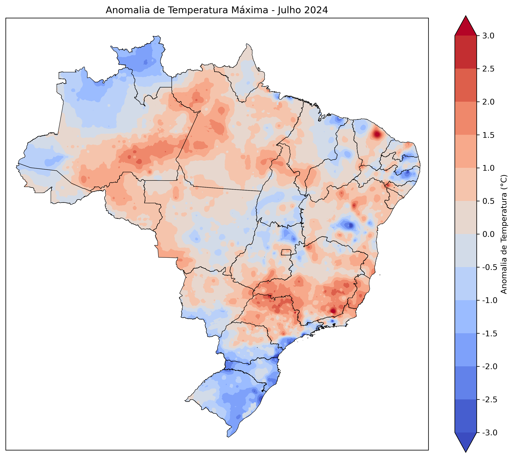
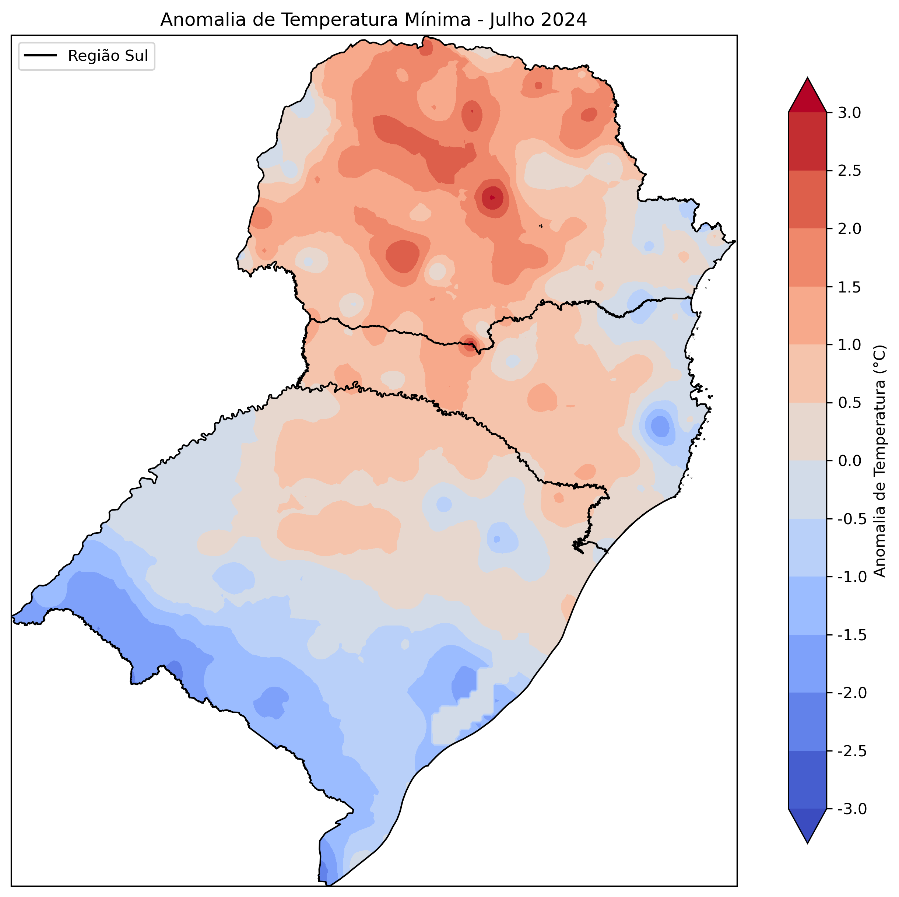

# SAMET-CPTEC

Este repositório contém scripts para a visualização dos dados de precipitação do produto SAMET do INPE/CPTEC. Este produto combina os dados observados com a reanálise ERA5, fazendo uma correção do campo de temperatura usando uma taxa de lapso estimada.

## Descrição

O projeto SAMET-CPTEC visa no aprofundamento de visualização de dados de anomalia de temperatura utilizando o produto SAMET do CPTEC/INPE. 

## Estrutura do Repositório

- `Scripts/`: Contém scripts utilizados para processar e analisar os dados.
- `Dados/`: Contém os dados brutos e processados.
- `Figuras/`: Contém figuras geradas a partir dos dados.

## Pré-requisitos

Antes de executar os scripts, você precisará instalar as seguintes bibliotecas Python:

- numpy
- geopandas
- matplotlib
- pygrib
- cartopy
- xarray
- netCDF4
  
## Imagens

### Figura 1: Exemplo de Anomalia de Temperatura Mínima Mensal



### Figura 2: Exemplo de Anomalia de Temperatura Máxima Mensal



### Figura 3: Exemplo de Anomalia de Temperatura Mínima Mensal- Sul



## Como Utilizar

1. Clone este repositório:
    ```bash
    git clone https://github.com/valkiriaandrade/SAMET-CPTEC.git
    ```

2. Navegue até o diretório do projeto:
    ```bash
    cd SAMET-CPTEC
    ```

3. Execute os scripts conforme necessário.

## Contribuições

Contribuições são bem-vindas! Sinta-se à vontade para abrir issues e pull requests.

## Licença

Este projeto está licenciado sob a Licença MIT. Veja o arquivo [LICENSE](LICENSE) para mais detalhes.

